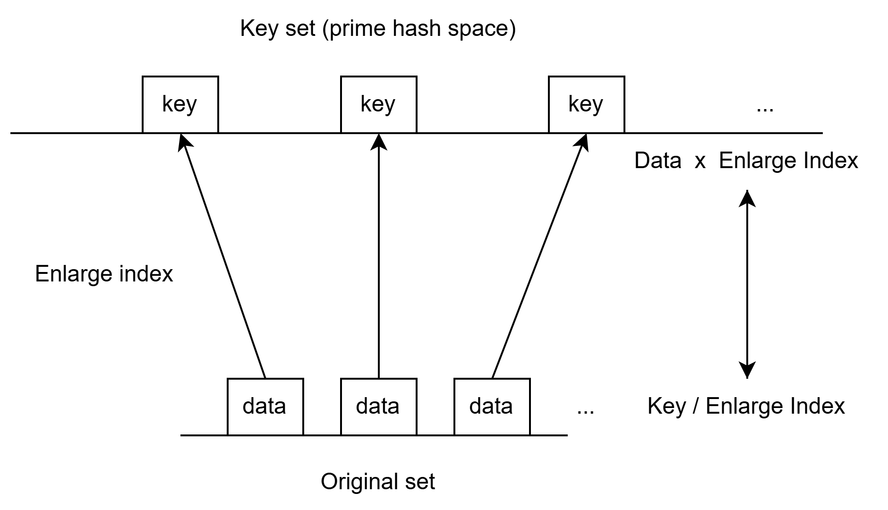

# 理论基础
## 1. 算术基础定理
> $n$的标准型是唯一的。也就是说，除了因子可以重新排列以外，$n$只能用唯一一种方式表示成素数的乘积
- 《哈代数论（第六版）》
	- G.Y. Hardy
	- ISBN:978-7-115-23203-8

## 2. Euclid 第二定理
> 素数无限
- 《哈代数论（第六版）》
	- G.Y. Hardy
	- ISBN:978-7-115-23203-8

---
# 质数哈希函数
## 1. 放大因子(Enlarge index)
> $ei=2^{n}$
- 将原始数据域扩大到一个合适的大小($ei$)，使得新的域中存在的所有质数与原始数据域形成满射关系。

## 2. 放大因子验证函数
> $x\lt\pi(x*ei)(x=max({n|n\in[0,y]})$
- 验证新的域$[0,x]$是否存在足够的质数
- $\pi$函数是用来检测从0到给定数值范围内的质数数量的函数，记作$\pi(x)=\frac{x}{ln(x)}$
- 由于质数的分布不均匀，因此比较关系是严格大于而不是大于等于
- 除了上述简化函数，也可以使用更严格的最大质数距离检测方法（穷举域中的质数，并让$ei$严格大于域中两个质数之间的最大距离）

## 3. 质数哈希空间
> $phs(x)=\{p|(z*ei\ge p \ge ei \lor p = 2) \land is\_prime(p)\} ,(0\le x\le2^n)$
- 对于原始域（计算机中一般是$2^n$），一个质数哈希空间需要满足：
	1. 空间中的元素$p$大于放大因子（当$x$为1时）
	2. $p$小于等于空间的上界
	3. $p=2$（当$x$为0时）
	4. 且不论如何，$p$是一个质数

## 4.  质数哈希函数
>对于给定数据$x$，质数哈希函数$phf(x)$会将原始数据放大$ei$后映射到质数哈希空间。然后寻找$x*ei$的下一个质数。因为经过**放大因子验证函数**检测后的$ei$可以保证新空间存在足够数量的质数键可以供原数据空间使用。

---
# 执行查询和数据存储

1. 输入的数据经过质数哈希函数生成**哈希质数键**，且数据库实际存储该键而非数据
2. 每条记录由若干个质数键区域组成，并可以使用所有质数键的乘积作为**记录键**，从而表示记录
3. 在查询时，将条件转为质数，并可以将多个条件乘为一个**条件键**。如果条件键与记录键取余运算后不为0，则证明当前条件有一个或多个不满足
4. 此查询方式**基于记录**而非列生成**位向量**，因此每张表在查询时只会生成一个位向量
5. 因为原始数据与质数哈希空间是满射关系，因此在某个元素的$\pm ei$范围内只有当前质数键，因此使用当前质数键除以放大因子即可还原出原始数据，时间复杂度为$O(1)$